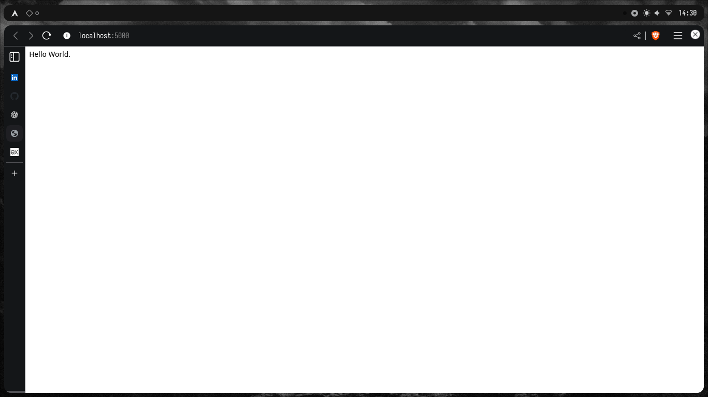

# 📚 Guia de Estudos Fullstack com JavaScript

Este documento serve como **anotação pessoal** para organizar meu aprendizado de **desenvolvimento fullstack** usando JavaScript, inspirado em padrões profissionais de grandes empresas.  
Aqui estão: tech stack detalhada, plano de estudos, esqueleto inicial e dicas práticas.

---

## 🔧 Tech Stack (com explicações)

### 🌐 Frontend

- **React** → Biblioteca para criar interfaces baseadas em componentes.
- **Next.js (opcional)** → Framework sobre React, adiciona SSR, SSG e melhor SEO.
- **TailwindCSS** → Framework de utilitários CSS para acelerar desenvolvimento de UI responsiva.
- **Gerenciamento de estado:**
  - **Zustand** → Leve, fácil de usar.
  - **Redux Toolkit** → Mais robusto, muito usado em empresas.
- **React Query (TanStack Query)** → Gerencia chamadas a API (cache, revalidação automática).
- **UI Libraries:** shadcn/ui ou Material UI para ter componentes prontos e acessíveis.
- **Testes:** Vitest ou Jest + React Testing Library.
- **Qualidade de código:** ESLint + Prettier + Husky (pré-commit hooks).

---

### ⚙️ Backend

- **Node.js** → Runtime JavaScript para o servidor.
- **Express.js** → Framework minimalista para APIs REST.
- **JWT + Refresh Tokens** → Padrão de autenticação segura.
- **bcrypt** → Para hashing de senhas.
- **Swagger/Redoc** → Documentação automática da API.
- **Testes:** Jest + Supertest para rotas e middlewares.
- **Qualidade de código:** ESLint, Prettier, commitlint.

---

### 🗄️ Banco de Dados

- **MongoDB + Mongoose** → Orientado a documentos, simples para começar.
- **PostgreSQL + Prisma** → Relacional, forte em produção, ótimo para times grandes.

---

### 🛠️ Infraestrutura / DevOps

- **Git + GitHub** → Controle de versão.
- **Docker + Docker Compose** → Facilita rodar app + banco em qualquer ambiente.
- **CI/CD (GitHub Actions)** → Automatizar testes e deploy.
- **Deploy:**
  - Frontend → Vercel
  - Backend → Render ou Railway
  - Banco → MongoDB Atlas ou Neon (Postgres)

---

## 🗺️ Plano de Estudos

### 1. Fundamentos do JavaScript (2–3 semanas)

- Variáveis, funções, objetos, arrays.
- ES6+: arrow functions, destructuring, spread/rest.
- Promises e async/await.
- Event loop.  
  ✅ Prática: recriar métodos `map`, `filter`, `reduce`.

---

### 2. Frontend com React (3–4 semanas)

- Componentes funcionais.
- Props e state.
- Hooks básicos: `useState`, `useEffect`.
- Rotas com React Router.
- Consumo de API.  
  ✅ Prática: To-Do List com CRUD no localStorage.

---

### 3. Backend com Node.js + Express (3–4 semanas)

- Rotas GET, POST, PUT, DELETE.
- Middlewares (logs, erros, autenticação).
- Conexão com banco de dados.
- Autenticação com JWT.  
  ✅ Prática: API de tarefas simples.

---

### 4. Banco de Dados (2 semanas)

- Modelagem de entidades.
- MongoDB: coleções, consultas.
- Postgres: tabelas, relacionamentos, joins.  
  ✅ Prática: schema de usuários e tarefas.

---

### 5. Integração Fullstack (2 semanas)

- Frontend consumindo API.
- Login/logout com JWT.
- Dashboard com dados do backend.  
  ✅ Prática: autenticação funcionando end-to-end.

---

### 6. Padrões Profissionais (contínuo)

- Git Flow (branches, PRs).
- ESLint + Prettier.
- Testes unitários/integrados.
- Docker para rodar ambiente.
- CI/CD com GitHub Actions.

---

### 7. Extras (opcional)

- WebSockets para tempo real.
- Upload de arquivos.
- Internacionalização (i18n).
- Dark/Light mode.

---

## 📂 Estrutura de Pastas

taskflow/
├── client/ # Frontend (React/Next)
│ ├── src/
│ │ ├── components/
│ │ ├── pages/
│ │ ├── hooks/
│ │ └── store/
│ └── package.json
├── server/ # Backend (Node/Express)
│ ├── src/
│ │ ├── controllers/
│ │ ├── models/
│ │ ├── routes/
│ │ └── middlewares/
│ └── package.json
├── docker-compose.yml
└── notes.md # este arquivo

Primeiro Teste:

